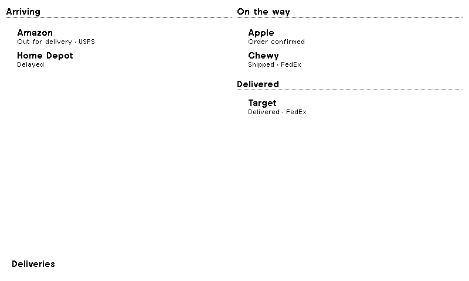

# Wallet Deliveries for TRMNL

An e-ink delivery board fed by **Apple Wallet's order tracking** — no Parcel account, no email scanner, no server in the middle.



```
iPhone notification (Wallet / carrier)
        │  Shortcuts automation, runs immediately
        ▼
Shortcut: match merchant + status → POST one event
        │  { merge_variables: { events: [...] }, merge_strategy: stream }
        ▼
TRMNL private plugin (webhook strategy) → rolling list → e-ink screen
```

## Why this shape

Wallet's order tracking is on-device Apple Intelligence reading Mail. Apple exposes **no API and no Shortcuts action** that enumerates the Orders list, so nothing can pull that list directly. What iOS 27 does expose is the **notification automation**: when Wallet posts a delivery update, a Shortcut can read the notification's text and forward it.

Two consequences are designed into this recipe:

1. **The phone keeps no state.** Each notification becomes one small event, and TRMNL's `stream` merge strategy appends it to a rolling list (last 20). The plugin's markup then reduces that list to one row per merchant — newest event wins — and sorts rows into buckets. Nothing has to be seeded, migrated, or upserted on the phone, which is why the shortcut is four actions and not twenty.
2. **Payloads stay small.** One event is a few dozen bytes, far under the webhook ceiling, and `scripts/validate-plugin.rb` fails the build if a sample payload or a layout regresses.

## Requirements

- **iOS 27** on an **Apple Intelligence iPhone** (15 Pro or newer) — Wallet's Mail-based order tracking depends on it.
- Wallet order tracking enabled: **Settings → Wallet & Apple Pay → Order Tracking → Mail**.
- Delivery notifications left unmuted for orders you want on the screen.
- A TRMNL device, with the plugin on a playlist.

## Setup

1. **Install this recipe** (Plugins → Recipes → Install) or fork it to customise.
2. **Copy the Webhook URL** from the plugin instance's configuration form. This URL only appears in the TRMNL UI — no API exposes it.
3. **Import the shortcut** from [`shortcuts/Wallet Deliveries.shortcut`](shortcuts) and paste that URL into its last action. [`SHORTCUT.md`](SHORTCUT.md) covers the import, the two automation triggers and every field the shortcut reads.
4. **Add the plugin to a device playlist**, otherwise the instance never renders on the panel.

No email credentials, no third-party tracking service and no server are involved at any point.

## Payload contract

Each notification posts one event:

```json
{
  "merge_variables": {
    "events": [
      {
        "merchant": "Amazon",
        "phrase": "out for delivery",
        "carrier": "USPS",
        "tracking": "TBA123456789"
      }
    ]
  },
  "merge_strategy": "stream",
  "stream_limit": 20
}
```

`phrase` is the matched status wording, not an enum — the markup maps it by keyword (`delayed`/`attempted` → issue, `out for delivery`/`arriving` → today, `shipped`/`in transit`/`on its way`/`order confirmed` → moving, `delivered` → delivered). An unrecognized phrase renders as "Update" rather than breaking the screen. `carrier` and `tracking` are empty strings when the notification doesn't state them, and are then not shown.

Anything may post to this plugin — the shortcut is a convenience, not a requirement.

## Layouts

| View | Panel | Shows |
| --- | --- | --- |
| Full | 800×480 | Arriving (today + issues) and On the way, with Delivered below |
| Half horizontal | 800×240 | Three columns: Arriving, On the way, Delivered |
| Half vertical | 400×480 | Stacked sections |
| Quadrant | 400×240 | The two most urgent rows |

Every view is rendered at its exact panel size during development and checked for clipping before release. `images/` holds the screenshots used on the recipe page.

## Custom fields

| Field | Purpose |
| --- | --- |
| Screen title | Text for the bottom title bar |
| Show carrier | Carrier name on each row |
| Show tracking | Tracking number tail (off by default — space is tight) |
| Hide delivered | Drop delivered rows entirely |
| Max deliveries | Upper bound on rendered rows per column |

## Local development

```sh
ruby scripts/validate-plugin.rb      # renders every layout against every sample, lints template scope
trmnlp lint                          # TRMNL's own recipe lint
trmnlp serve                         # live preview at http://localhost:4567
scripts/screenshot-layouts.sh        # headless-Chrome renders at exact panel sizes
python3 scripts/make-images.py <render-dir>   # rebuild images/ from those renders
python3 scripts/make-shortcut.py production "shortcuts/Wallet Deliveries.shortcut"
trmnlp push --force                  # upload to trmnl.com (needs TRMNL_API_KEY)
```

Two things worth knowing before editing the markup:

- **Template scopes are isolated.** TRMNL renders `` bodies through Shopify's Liquid, so a template sees only the arguments its `` call passes. A layout variable that isn't passed arrives as `nil` and the section renders empty, silently. `scripts/validate-plugin.rb` lints every call site for exactly this.
- **`src/settings.yml` is load-bearing.** `id:` must stay pinned to the existing plugin instance or `trmnlp push` creates a duplicate, and `trmnlp push` rewrites the file's key order, so read it back before parsing it.

`scripts/trmnl-api.py` talks to the TRMNL API with a user key for inspecting a deployed instance: `details`, `merge-vars`, `data`, `refresh`, `screenshot`.

## Known limits

- **No backlog.** The first render only shows what arrives after the automation is live; Wallet's history has no export.
- **Wallet (or Mail) must be the notifier.** A package whose status only ever appeared in Mail (Amazon, often) produces no Wallet notification — add the Mail automation described in `SHORTCUT.md` to catch those.
- **One row per merchant.** A merchant shipping three things shows once, with its latest status; the stream keeps the history, the screen shows the headline.
- **Notification-driven**, so a quiet day is a quiet screen until the next event.

## License

MIT — see [LICENSE](LICENSE). Issues and pull requests welcome.

The recipe icon is Microsoft's [Fluent Emoji](https://github.com/microsoft/fluentui-emoji) "Delivery
truck": MIT, © Microsoft Corporation. The licence text ships in
[`assets/fluent-emoji-LICENSE.txt`](assets/fluent-emoji-LICENSE.txt) and the source art in
[`assets/icon-source.png`](assets/icon-source.png) — `scripts/make-images.py` resizes that file into
`images/icon.png`, so a rebuild can't quietly swap the icon.
